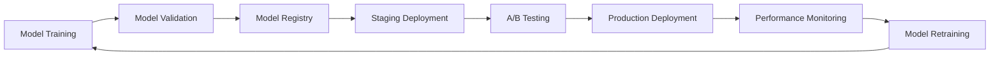
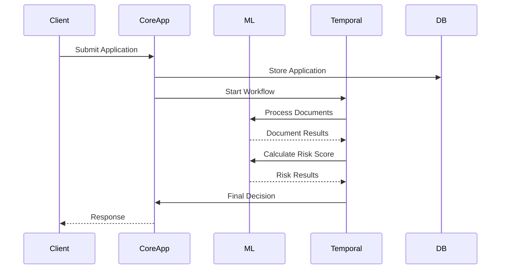
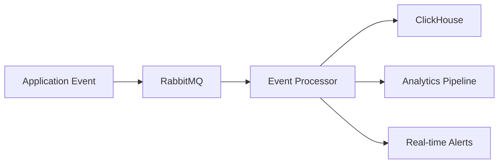

# Introduction to Metis Platform

> **Metis** is a modern, multi-tenant SAAS platform designed for financial institutions, built with modularity, security, and scalability at its core.

## 🚀 Platform Overview

Metis is our comprehensive SAAS platform that enables financial institutions to streamline their operations through intelligent automation, machine learning, and configurable business processes. The platform is designed around three core logical spaces that work together to deliver a complete solution.

**Key Characteristics:**
- **Multi-tenant Architecture**: Secure isolation between clients
- **Pluggable Components**: Modular design for flexible client configurations
- **ML-Powered**: Built-in machine learning capabilities
- **Workflow-Driven**: Temporal-based business process orchestration

---

## 🏗️ High-Level Architecture

```
┌─────────────────────────────────────────────────────────────────┐
│                        METIS PLATFORM                          │
├─────────────────────────────────────────────────────────────────┤
│  🎯 CORE APP SPACE                                             │
│  ├─ Client-Specific Plugins                                    │
│  ├─ Core App Interface                                         │
│  ├─ LOS (Loan Origination System)                             │
│  ├─ Rules Engine                                               │
│  └─ Fraud Score Engine                                         │
├─────────────────────────────────────────────────────────────────┤
│  🧠 ML SPACE                                                   │
│  ├─ Common Models (OCR, Classification)                        │
│  ├─ Client-Specific Models (Risk, Fraud)                       │
│  ├─ Model Registry & Versioning                                │
│  └─ Feature Engineering Pipeline                               │
├─────────────────────────────────────────────────────────────────┤
│  🛠️ UTIL & INFRASTRUCTURE                                     │
│  ├─ Temporal (Workflow Orchestration)                          │
│  ├─ PostgreSQL (Primary Database)                              │
│  ├─ S3 (Object Storage)                                        │
│  ├─ RabbitMQ (Message Queue)                                   │
│  ├─ DuckDB (Analytics)                                         │
│  ├─ Redis (Caching)                                            │
│  └─ ClickHouse (Event Storage)                                 │
└─────────────────────────────────────────────────────────────────┘
```

---

## 🎯 Core App Space

The Core App Space contains all client-specific business logic and serves as the primary interface for users and external systems.

### **Core App Interface**
- **Single Entry Point**: All external communication flows through this interface
- **Plugin Management**: Dynamically loads and configures client-specific plugins
- **Multi-tenant Routing**: Routes requests to appropriate tenant contexts
- **API Gateway**: Provides unified API access to all platform capabilities

### **Pluggable Components**

#### **LOS (Loan Origination System)**
```go
type LOSPlugin struct {
    ClientID     string
    WorkflowType string
    Rules        []BusinessRule
    Integrations []ExternalAPI
}

func (los *LOSPlugin) ProcessApplication(ctx context.Context, app *LoanApplication) (*Decision, error) {
    // Client-specific loan processing logic
    return los.executeWorkflow(ctx, app)
}
```

#### **Rules Engine**
```go
type RulesEngine struct {
    ClientRules map[string][]Rule
    Evaluator   *RuleEvaluator
}

func (re *RulesEngine) EvaluateApplication(clientID string, data map[string]interface{}) (*RuleResult, error) {
    rules := re.ClientRules[clientID]
    return re.Evaluator.Evaluate(rules, data)
}
```

#### **Fraud Score Engine**
```go
type FraudEngine struct {
    ModelRegistry *MLModelRegistry
    FeatureStore  *FeatureStore
}

func (fe *FraudEngine) CalculateFraudScore(ctx context.Context, application *Application) (*FraudScore, error) {
    features := fe.FeatureStore.ExtractFeatures(application)
    model := fe.ModelRegistry.GetModel(application.ClientID, "fraud")
    return model.Predict(features)
}
```

### **Client Configuration Examples**

#### **Traditional Bank Setup**
```yaml
client_id: "bank_traditional"
plugins:
  - name: "los"
    config:
      workflow: "traditional_approval"
      manual_review_threshold: 0.7
  - name: "rules_engine"
    config:
      rule_sets: ["credit_policy", "compliance"]
  - name: "fraud_engine"
    config:
      model_version: "conservative_v2"
```

#### **Fintech Startup Setup**
```yaml
client_id: "fintech_fast"
plugins:
  - name: "los"
    config:
      workflow: "instant_approval"
      auto_approve_threshold: 0.8
  - name: "rules_engine"
    config:
      rule_sets: ["basic_eligibility"]
  - name: "fraud_engine"
    config:
      model_version: "aggressive_v1"
```

---

## 🧠 ML Space

The ML Space provides intelligent capabilities through machine learning models and data processing pipelines.

### **Architecture Principles**
- **Model Isolation**: Each model runs in its own context
- **Version Management**: Support for multiple model versions
- **A/B Testing**: Compare model performance across versions
- **Feature Consistency**: Standardized feature engineering

### **Common Models**

#### **OCR Engine**
```python
class OCRModel(BaseModel):
    """Universal document text extraction."""

    def extract_text(self, document: bytes, document_type: str) -> OCRResult:
        """Extract text from various document types."""
        preprocessed = self.preprocess_document(document, document_type)
        text_data = self.model.predict(preprocessed)
        return self.postprocess_text(text_data, document_type)

    def extract_fields(self, text_data: str, document_type: str) -> Dict[str, str]:
        """Extract specific fields based on document type."""
        field_extractor = self.get_field_extractor(document_type)
        return field_extractor.extract(text_data)
```

#### **Document Classification**
```python
class DocumentClassifier(BaseModel):
    """Classify document types automatically."""

    def classify(self, document: bytes) -> ClassificationResult:
        """Classify document type and confidence."""
        features = self.extract_visual_features(document)
        prediction = self.model.predict(features)
        return ClassificationResult(
            document_type=prediction.class_name,
            confidence=prediction.confidence,
            processing_pipeline=self.get_pipeline(prediction.class_name)
        )
```

### **Client-Specific Models**

#### **Risk Assessment Models**
```python
class ClientRiskModel(BaseModel):
    """Client-specific risk scoring."""

    def __init__(self, client_id: str):
        self.client_id = client_id
        self.model = self.load_client_model(client_id)
        self.feature_config = self.load_feature_config(client_id)

    def calculate_risk_score(self, application_data: Dict) -> RiskScore:
        """Calculate client-specific risk score."""
        features = self.extract_features(application_data)
        risk_score = self.model.predict(features)

        return RiskScore(
            score=risk_score,
            category=self.categorize_risk(risk_score),
            factors=self.explain_prediction(features),
            model_version=self.model.version
        )
```

### **Model Deployment Pipeline**



---

## 🛠️ Util & Infrastructure Components

The infrastructure layer provides foundational services that support both Core App and ML spaces.

### **Temporal - Workflow Orchestration**

**Purpose**: Orchestrates complex business processes with reliability and scalability.

**Key Features**:
- **Durable Execution**: Workflows survive service restarts
- **Retry Logic**: Automatic retry with exponential backoff
- **State Management**: Maintains workflow state across activities
- **Versioning**: Support for workflow version upgrades

**Example Workflow**:
```go
func LoanProcessingWorkflow(ctx workflow.Context, application LoanApplication) error {
    // Step 1: Document Processing
    var docResult DocumentResult
    err := workflow.ExecuteActivity(ctx, ProcessDocuments, application.Documents).Get(ctx, &docResult)
    if err != nil {
        return err
    }

    // Step 2: Risk Assessment
    var riskResult RiskResult
    err = workflow.ExecuteActivity(ctx, AssessRisk, application, docResult).Get(ctx, &riskResult)
    if err != nil {
        return err
    }

    // Step 3: Decision Making
    decision := makeDecision(riskResult)

    // Step 4: Notification
    return workflow.ExecuteActivity(ctx, NotifyApplicant, decision).Get(ctx, nil)
}
```

### **PostgreSQL - Primary Database**

**Purpose**: Main relational database for structured data storage.

**Key Features**:
- **ACID Compliance**: Ensures data consistency
- **JSON Support**: Native JSON querying capabilities
- **Extensions**: PostGIS for geospatial data, vector extensions
- **Multi-tenant Support**: Row-level security for tenant isolation

**Schema Design**:
```sql
-- Multi-tenant table structure
CREATE TABLE applications (
    id UUID PRIMARY KEY,
    tenant_id UUID NOT NULL,
    applicant_data JSONB,
    status VARCHAR(50),
    created_at TIMESTAMP DEFAULT NOW(),
    updated_at TIMESTAMP DEFAULT NOW()
);

-- Row-level security for multi-tenancy
ALTER TABLE applications ENABLE ROW LEVEL SECURITY;
CREATE POLICY tenant_isolation ON applications
    USING (tenant_id = current_setting('app.current_tenant')::UUID);
```

### **S3 - Object Storage**

**Purpose**: Scalable storage for files, documents, and large data objects.

**Use Cases**:
- **Document Storage**: Original and processed documents
- **Model Artifacts**: ML model files and configurations
- **Event Logs**: Long-term storage of platform events
- **Backup Storage**: Database backups and disaster recovery

**Storage Structure**:
```
metis-platform-bucket/
├── documents/
│   ├── {tenant_id}/
│   │   ├── {application_id}/
│   │   │   ├── original/
│   │   │   └── processed/
├── models/
│   ├── common/
│   │   ├── ocr/
│   │   └── classification/
│   └── client-specific/
│       └── {client_id}/
├── events/
│   └── year={year}/month={month}/day={day}/
└── backups/
    ├── database/
    └── configurations/
```

### **RabbitMQ - Message Queue**

**Purpose**: Asynchronous message processing and event distribution.

**Queue Structure**:
```go
// Queue definitions
const (
    DocumentProcessingQueue = "document.processing"
    RiskAssessmentQueue    = "risk.assessment"
    NotificationQueue      = "notifications"
    EventsQueue           = "events.analytics"
)

// Message publishing
func PublishDocumentProcessing(doc *Document) error {
    message := DocumentProcessingMessage{
        DocumentID: doc.ID,
        TenantID:   doc.TenantID,
        Type:       doc.Type,
        Priority:   doc.Priority,
    }

    return publisher.Publish(DocumentProcessingQueue, message)
}
```

### **DuckDB - Analytics Database**

**Purpose**: High-performance analytics and reporting on large datasets.

**Key Features**:
- **Columnar Storage**: Optimized for analytical queries
- **Embedded Database**: No separate server required
- **SQL Interface**: Standard SQL for complex analytics
- **Parquet Integration**: Direct querying of Parquet files

**Analytics Queries**:
```sql
-- Application approval rates by client
SELECT
    client_id,
    COUNT(*) as total_applications,
    SUM(CASE WHEN status = 'approved' THEN 1 ELSE 0 END) as approved,
    ROUND(100.0 * SUM(CASE WHEN status = 'approved' THEN 1 ELSE 0 END) / COUNT(*), 2) as approval_rate
FROM applications
WHERE created_at >= '2024-01-01'
GROUP BY client_id
ORDER BY approval_rate DESC;
```

### **Redis - Caching Layer**

**Purpose**: High-performance caching and session management.

**Use Cases**:
- **Session Storage**: User session data
- **Model Caching**: Frequently used ML model results
- **Rate Limiting**: API rate limiting counters
- **Feature Store**: Real-time feature caching

### **ClickHouse - Event Storage**

**Purpose**: High-performance storage and querying of event data.

**Event Schema**:
```sql
CREATE TABLE events (
    timestamp DateTime64(3),
    tenant_id String,
    event_type String,
    user_id String,
    session_id String,
    event_data String,
    INDEX idx_tenant_time (tenant_id, timestamp) TYPE minmax GRANULARITY 8192
) ENGINE = MergeTree()
PARTITION BY toYYYYMM(timestamp)
ORDER BY (tenant_id, event_type, timestamp);
```

---

## 🔄 Integration Patterns

### **Request Flow**


### **Event-Driven Architecture**


---

## 🔒 Security & Multi-Tenancy

### **Tenant Isolation**
- **Database Level**: Row-level security policies
- **Application Level**: Tenant context in all operations
- **Storage Level**: Tenant-specific S3 prefixes
- **Network Level**: VPC isolation for sensitive clients

### **Authentication & Authorization**
```go
type TenantContext struct {
    TenantID    string
    UserID      string
    Permissions []Permission
    SessionID   string
}

func (tc *TenantContext) HasPermission(resource string, action string) bool {
    for _, perm := range tc.Permissions {
        if perm.Resource == resource && perm.Action == action {
            return true
        }
    }
    return false
}
```

---

## 📊 Monitoring & Observability

### **Key Metrics**
- **Application Processing Time**: End-to-end processing duration
- **Model Performance**: Accuracy, precision, recall metrics
- **System Health**: CPU, memory, disk usage
- **Business Metrics**: Approval rates, processing volumes

### **Alerting**
```go
type Alert struct {
    Type        string
    Severity    string
    Message     string
    TenantID    string
    Timestamp   time.Time
    Metadata    map[string]interface{}
}

// Example alerts
var (
    HighErrorRateAlert = Alert{
        Type:     "system",
        Severity: "critical",
        Message:  "Error rate exceeded threshold",
    }

    ModelDriftAlert = Alert{
        Type:     "ml",
        Severity: "warning",
        Message:  "Model performance degradation detected",
    }
)
```

---

## 🚀 Scalability & Performance

### **Horizontal Scaling**
- **Stateless Services**: All services designed to be stateless
- **Load Balancing**: Distribute traffic across service instances
- **Auto-scaling**: Kubernetes-based auto-scaling policies
- **Database Sharding**: Tenant-based database sharding strategy

### **Performance Optimization**
- **Caching Strategy**: Multi-layer caching (Redis, application-level)
- **Async Processing**: Non-blocking operations where possible
- **Connection Pooling**: Efficient database connection management
- **CDN Integration**: Static asset delivery optimization

---

## 🎯 Future Roadmap

### **Immediate Enhancements**
1. **Advanced ML Pipeline**: AutoML capabilities for client-specific models
2. **Real-time Analytics**: Stream processing for real-time insights
3. **Mobile SDK**: Native mobile application support
4. **API Marketplace**: Third-party integration marketplace

### **Long-term Vision**
1. **AI-Powered Insights**: Advanced analytics and predictive capabilities
2. **Blockchain Integration**: Immutable audit trails and smart contracts
3. **Edge Computing**: Edge-based processing for latency-sensitive operations
4. **Global Expansion**: Multi-region deployment capabilities

---

*This overview provides the foundation for understanding the Metis platform architecture. For detailed technical implementation, refer to [Data Flow](architecture-part-1.md), [Data Storage](architecture-part-2.md), and [Data Processing](architecture-part-3.md) documents.*
