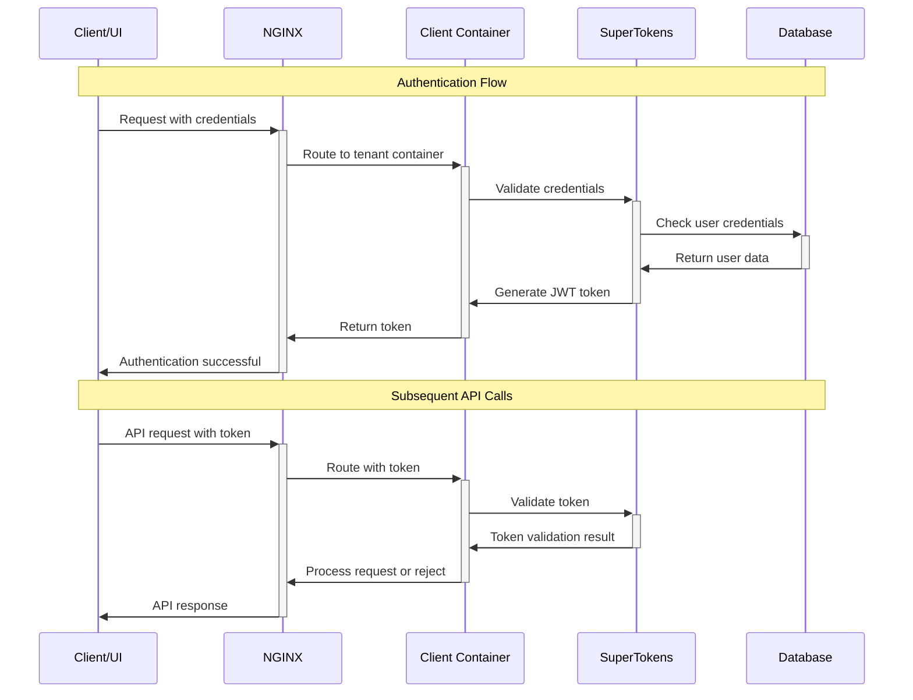
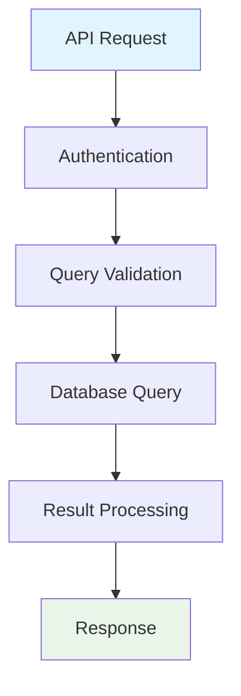
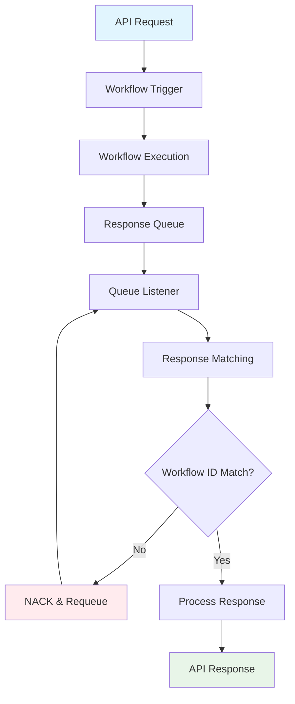
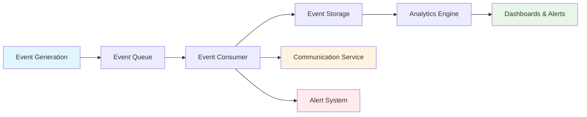

# Metis Platform Architecture - Part 1: Data Flow

> **Part 1 of 3**: This document focuses specifically on **data flow patterns** within the Metis platform. For complete architectural context, refer to the main architecture document and upcoming parts on storage and processing.

## 🌊 Introduction

Data flow being core to Metis platform, orchestrating how information moves through our multi-tenant SAAS architecture. This document provides a comprehensive overview of request handling, authentication, state management, and event-driven processing patterns that enable our platform to serve multiple clients efficiently and securely.

Our data flow architecture is designed around **two fundamental patterns**:

- **Read Flows**: Query and retrieval operations
- **Write Flows**: State-changing operations with complex orchestration

---

## 🏗️ Data Flow Architecture Overview

The below diagram shows how data flows in our multi-tenant architecture -

```
┌─────────────────────────────────────────────────────────────────┐
│                    METIS DATA FLOW ARCHITECTURE                 │
├─────────────────────────────────────────────────────────────────┤
│  🌐 ENTRY LAYER                                                │
│  ├─ NGINX (Reverse Proxy)                                      │
│  └─ Load Balancing & SSL Termination                           │
├─────────────────────────────────────────────────────────────────┤
│  🏢 TENANT LAYER                                               │
│  ├─ Client Container 1 ├─ Client Container 2 ├─ Client Container N │
│  └─ Isolated tenant-specific processing                        │
├─────────────────────────────────────────────────────────────────┤
│  🔐 AUTHENTICATION LAYER                                        │
│  ├─ SuperTokens Server                                          │
│  └─ Token Management & Validation                               │
├─────────────────────────────────────────────────────────────────┤
│  🔄 ORCHESTRATION LAYER                                         │
│  ├─ State Machine Validation                                    │
│  ├─ Temporal Workflows                                          │
│  └─ Event-Driven Processing                                     │
├─────────────────────────────────────────────────────────────────┤
│  💾 SHARED INFRASTRUCTURE                                       │
│  ├─ Multi-tenant Database                                       │
│  ├─ Common ML Services                                          │
│  └─ Message Queues & Storage                                    │
└─────────────────────────────────────────────────────────────────┘
```

---

## 🚪 Entry Point & Request Routing

### **NGINX Reverse Proxy**
Our platform entry point handles all incoming requests through a centralized reverse proxy:

#### Key Responsibilities:
- **SSL Termination**: Secure HTTPS handling
- **Load Balancing**: Distribute requests across tenant containers
- **Request Routing**: Direct requests to appropriate client containers
- **Rate Limiting**: Protect against abuse and ensure fair usage
- **Static Content**: Serve static assets efficiently

#### Routing Logic:
```
Incoming Request → NGINX → Client Container Selection → Authentication → Processing
```

### **Multi-Tenant Container Architecture**
- **N Clients = N Containers**: Each client gets dedicated container isolation
- **Shared Infrastructure**: All containers access common multi-tenant components
- **Resource Isolation**: Prevents client interference while sharing infrastructure costs

---

## 🔐 Authentication & Authorization Flow

### **Token-Based Security Model**

Our platform implements a comprehensive token-based authentication system using **SuperTokens**:



### **Token Generation Methods**

#### 1. **App Login** 🔑
- **User Authentication**: Username/password login
- **Session Management**: Persistent login sessions
- **Token Refresh**: Automatic token renewal

#### 2. **Agent Login** 👥
- **Agent Portal**: Dedicated agent interface
- **Role-Based Access**: Different permission levels
- **Audit Trail**: Track agent actions

#### 3. **Server-to-Server (S2S)** 🔗
- **API Keys**: Access key and secret pairs
- **Service Authentication**: Backend service integration
- **Programmatic Access**: Automated system interactions

### **Security Validation Pipeline**
Every API call follows this security validation sequence:
1. **Token Extraction**: Extract token from request headers
2. **Token Validation**: Verify token authenticity with SuperTokens
3. **Authorization Check**: Validate user permissions for requested resource
4. **Request Processing**: Proceed with business logic if authorized

---

## 📊 Data Flow Patterns

### **Read Flows** 📖

Read flows handle query and retrieval operations with minimal complexity:



#### Characteristics:
- **Stateless Operations**: No system state changes
- **Database-Heavy**: Primary processing in database layer
- **Fast Response**: Optimized for quick data retrieval
- **Cacheable**: Future caching implementation for high-frequency queries

#### Examples:
- Fetch list of banks
- Check user progress
- Retrieve transaction history
- Generate reports

---

### **Write Flows** ✍️

Write flows handle complex state-changing operations with sophisticated orchestration:

```mermaid
sequenceDiagram
    participant C as Client
    participant CC as Client Container
    participant SM as State Machine
    participant TW as Temporal Workflow
    participant Q as Response Queue
    participant ML as ML Services
    participant DB as Database
    participant S3 as S3 Storage

    Note over C,S3: Write Flow Processing

    C->>+CC: Write API Request
    CC->>CC: Authentication & Authorization
    CC->>CC: Schema Validation
    CC->>+SM: Validate Current State
    SM->>-CC: State Validation Result

    alt Invalid State
        CC->>-C: State Error Response
    else Valid State
        CC->>CC: Preprocessing (File Upload to S3)
        CC->>+TW: Trigger Workflow
        TW->>-CC: Workflow ID
        CC->>+Q: Listen for Response

        Note over TW,S3: Async Workflow Processing
        TW->>+ML: ML Processing Request
        ML->>-TW: ML Results
        TW->>+DB: Store Results
        DB->>-TW: Confirmation
        TW->>+Q: Publish Result

        Q->>-CC: Workflow Response
        CC->>-C: Final API Response
    end
```

---

## 🔄 State Machine Management

### **Finite State Machine Implementation**

We use **qmuntal/stateless** library to implement configurable state machines for each tenant:

#### Sample State Configuration:
```json
{
      "states": [
        {
        "state_name": "provide_personal_details",
      "valid_next_states": ["provide_pan_details"],
      "required_fields": ["name", "email", "phone"],
      "validation_rules": ["email_format", "phone_format"]
        },
        {
        "state_name": "provide_pan_details",
      "valid_next_states": ["provide_aadhar_details"],
      "required_fields": ["pan_number", "pan_image"],
      "validation_rules": ["pan_format", "image_size"]
        },
        {
        "state_name": "provide_aadhar_details",
      "valid_next_states": ["document_verification", "completed"],
      "required_fields": ["aadhar_number", "aadhar_image"],
      "validation_rules": ["aadhar_format", "image_quality"]
    },
    {
      "state_name": "document_verification",
      "valid_next_states": ["completed", "provide_additional_docs"],
      "automated": true,
      "timeout": "5m"
    },
    {
      "state_name": "completed",
      "valid_next_states": [],
      "final_state": true
        }
      ]
      }
      ```

#### State Machine Benefits:
- **Validation**: Both UI and backend validate state transitions
- **Consistency**: Ensures proper workflow progression
- **Flexibility**: Configurable per tenant requirements
- **Debugging**: Clear state tracking for troubleshooting

---

## ⚡ Workflow Orchestration with Temporal

### **Asynchronous Processing Architecture**

Our platform leverages **Temporal** for complex business process orchestration:

#### Workflow Execution Pattern:


#### Key Features:

##### **1. Reliability & Fault Tolerance**
- **Automatic Retries**: Built-in retry mechanisms
- **State Persistence**: Workflow state survives failures
- **Resumption**: Continue from last successful step

##### **2. Event Loop Architecture**
- **Async Processing**: Non-blocking workflow execution
- **Queue-Based Communication**: Decoupled request/response
- **Timeout Management**: 5-minute TTL with DLQ fallback

##### **3. Third-Party Integration**
- **Waterfall Pattern**: Sequential API calls with fallbacks
- **Retry Logic**: Configurable retry strategies
- **Circuit Breaker**: Prevent cascade failures

---

## 📡 Event-Driven Architecture

### **Event Publishing & Processing**

Our platform implements comprehensive event-driven patterns for monitoring, analytics, and system integration:

#### Event Categories:

##### **Business Events** 📈
- `PAN_SUBMITTED`: User submits PAN details
- `PAN_OCR_PROCESSED`: OCR processing completed
- `PAN_VERIFICATION_FAILED`: Verification failed
- `LOAN_APPROVED`: Loan approval decision
- `DOCUMENT_UPLOADED`: Document upload event

##### **System Events** ⚙️
- `PROVIDER_A_UNHEALTHY`: External service health
- `WORKFLOW_TIMEOUT`: Process timeout events
- `AUTHENTICATION_FAILED`: Security events
- `RATE_LIMIT_EXCEEDED`: Usage monitoring

### **Event Processing Pipeline**



#### Event Storage & Analytics:
- **Parquet Format**: Efficient columnar storage
- **S3 Integration**: Scalable event data lake
- **Columnar Queries**: Fast aggregate analytics
- **Real-time Alerts**: Immediate notification system

---

## 🔍 Monitoring & Observability

### **Comprehensive Logging Strategy**

#### **Production Debugging Philosophy**
> "Debugging in production is done purely by log checking"

Our logging strategy ensures complete observability:

##### **Request Lifecycle Logging**
- **Entry Point**: Request received at NGINX
- **Authentication**: Token validation results
- **State Validation**: State machine decisions
- **Workflow Execution**: Temporal workflow progress
- **External Calls**: Third-party API interactions
- **Response Generation**: Final response preparation

##### **Log Levels & Categories**
```
DEBUG: Detailed execution flow
INFO:  Business process milestones
WARN:  Recoverable issues
ERROR: System failures requiring attention
FATAL: Critical system failures
```

### **Audit Trail Management**
- **Access Logs**: All API access patterns
- **User Actions**: Complete user journey tracking
- **Agent Activities**: Administrative action logging
- **System Changes**: Configuration and deployment logs

---

## ⚠️ Pitfalls & Risk Management

### **Common Pitfalls & Mitigation Strategies**

#### **1. Queue Management Issues** 🚨

**Pitfall**: Message queue overflow during high traffic
**Mitigation**:
- **Dead Letter Queue (DLQ)**: 5-minute TTL with offline analysis
- **Queue Monitoring**: Real-time queue depth tracking
- **Auto-scaling**: Dynamic worker scaling based on queue size
- **Circuit Breakers**: Prevent cascade failures

#### **2. Workflow Timeout Handling** ⏰

**Pitfall**: Long-running workflows causing resource exhaustion
**Mitigation**:
- **Timeout Configuration**: Per-workflow timeout settings
- **Progress Checkpoints**: Regular state persistence
- **Resource Limits**: Memory and CPU constraints
- **Graceful Degradation**: Fallback processing paths

#### **3. State Machine Inconsistencies** 🔄

**Pitfall**: State drift between UI and backend
**Mitigation**:
- **Single Source of Truth**: Centralized state configuration
- **Validation Sync**: Shared validation libraries
- **State Auditing**: Complete state transition logging
- **Recovery Procedures**: State correction mechanisms

#### **4. Authentication Token Issues** 🔐

**Pitfall**: Token expiration and refresh failures
**Mitigation**:
- **Graceful Token Refresh**: Automatic background renewal
- **Token Validation Caching**: Reduce SuperTokens load
- **Fallback Authentication**: Multiple auth methods
- **Session Management**: Proper session lifecycle handling

#### **5. Multi-Tenant Data Isolation** 🏢

**Pitfall**: Cross-tenant data leakage
**Mitigation**:
- **Container Isolation**: Dedicated tenant containers
- **Database Row-Level Security**: Tenant-aware queries
- **Access Control**: Strict authorization checks
- **Data Encryption**: Tenant-specific encryption keys

---

## 📊 Monitoring & Alerting Strategy

### **Key Metrics to Monitor**

#### **Performance Metrics**
- **Response Times**: API endpoint latency
- **Throughput**: Requests per second
- **Queue Depth**: Message queue backlogs
- **Workflow Duration**: Process completion times

#### **Health Metrics**
- **Container Health**: CPU, memory, disk usage
- **Database Performance**: Query execution times
- **External Service Health**: Third-party API status
- **Authentication Success Rate**: Login failure patterns

#### **Business Metrics**
- **User Journey Completion**: Funnel analysis
- **Error Rates**: Business process failures
- **Feature Usage**: Plugin utilization patterns
- **Client Activity**: Tenant-specific metrics

### **Alert Configuration**

#### **Critical Alerts** 🚨
- Authentication service down
- Database connection failures
- Workflow timeout exceeded
- Queue overflow conditions

#### **Warning Alerts** ⚠️
- High response times
- Increased error rates
- Resource utilization spikes
- External service degradation

---

## 🎯 Next Steps & Future Enhancements

### **Immediate Improvements**
1. **Metrics Dashboard**: Real-time operational visibility

### **Future Enhancements**
1. **Caching Layer**: Implement Redis for read-heavy operations
2. **Rate Limiting**: Advanced rate limiting per tenant
3. **GraphQL Integration**: Flexible query capabilities
4. **Event Sourcing**: Complete event-driven architecture
5. **Multi-Region Deployment**: Geographic distribution
6. **Advanced Analytics**: ML-powered operational insights
7. **Automated Scaling**: Container auto-scaling based on load


---
