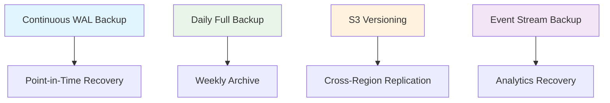

# Metis Platform Architecture - Part 2: Data Storage

> **Part 2 of 3**: This document focuses on **data storage architecture** within the Metis platform. For complete context, refer to [Introduction to Metis](architecture-overview.md) and [Data Flow](architecture-part-1.md).

## 💾 Introduction

Data storage is the foundation of the Metis platform, providing reliable, scalable, and secure data persistence across our multi-tenant architecture. This document covers database design, storage patterns, backup strategies, and data management practices that ensure data integrity and optimal performance.

Our storage architecture supports:
- **Multi-tenant data isolation**
- **Scalable storage solutions**
- **Comprehensive backup and recovery**
- **Performance optimization**

---

## 🏗️ Storage Architecture Overview

```
┌─────────────────────────────────────────────────────────────────┐
│                    METIS STORAGE ARCHITECTURE                   │
├─────────────────────────────────────────────────────────────────┤
│  🗄️ PRIMARY STORAGE                                            │
│  ├─ PostgreSQL (Multi-tenant Database)                         │
│  └─ Connection Pooling & Query Optimization                    │
├─────────────────────────────────────────────────────────────────┤
│  📁 OBJECT STORAGE                                             │
│  ├─ S3 (Documents, Images, Files)                              │
│  └─ MinIO (Development Environment)                            │
├─────────────────────────────────────────────────────────────────┤
│  📊 ANALYTICS STORAGE                                          │
│  ├─ ClickHouse (Event Analytics)                               │
│  └─ DuckDB (Embedded Analytics)                                │
├─────────────────────────────────────────────────────────────────┤
│  🔄 WORKFLOW STORAGE                                           │
│  ├─ Temporal Database                                          │
│  └─ Workflow State Management                                  │
├─────────────────────────────────────────────────────────────────┤
│  ⚡ CACHING LAYER                                              │
│  ├─ Redis (Session & Query Cache)                              │
│  └─ In-Memory Caching                                          │
└─────────────────────────────────────────────────────────────────┘
```

---

## 🗄️ Primary Database: PostgreSQL

### **Multi-Tenant Database Design**

Our PostgreSQL implementation uses a **shared database, shared schema** approach with tenant isolation through row-level security:

#### Database Schema Structure:
```sql
-- Core tenant table
CREATE TABLE tenants (
    id UUID PRIMARY KEY DEFAULT gen_random_uuid(),
    name VARCHAR(255) NOT NULL,
    subdomain VARCHAR(100) UNIQUE NOT NULL,
    created_at TIMESTAMP DEFAULT NOW(),
    updated_at TIMESTAMP DEFAULT NOW()
);

-- Example multi-tenant table
CREATE TABLE users (
    id UUID PRIMARY KEY DEFAULT gen_random_uuid(),
    tenant_id UUID NOT NULL REFERENCES tenants(id),
    email VARCHAR(255) NOT NULL,
    name VARCHAR(255) NOT NULL,
    created_at TIMESTAMP DEFAULT NOW(),
    UNIQUE(tenant_id, email)
);

-- Row Level Security
ALTER TABLE users ENABLE ROW LEVEL SECURITY;
CREATE POLICY tenant_isolation ON users
    USING (tenant_id = current_setting('app.current_tenant')::UUID);
```

### **Connection Management**

#### Connection Pooling Configuration:
```yaml
database:
  host: localhost
  port: 5432
  name: metis_db
  pool:
    max_connections: 25
    min_connections: 5
    max_idle_time: 30m
    max_lifetime: 1h
```

### **Query Optimization**

#### Indexing Strategy:
- **Tenant-aware indexes**: All queries include tenant_id
- **Composite indexes**: Frequently queried column combinations
- **Partial indexes**: For conditional queries
- **JSONB indexes**: For flexible document storage

```sql
-- Tenant-aware composite index
CREATE INDEX idx_users_tenant_email ON users(tenant_id, email);

-- JSONB index for metadata
CREATE INDEX idx_user_metadata ON users USING GIN(metadata);
```

---

## 📁 Object Storage: S3 & MinIO

### **Storage Strategy**

#### File Organization:
```
s3://metis-storage/
├── tenants/
│   ├── {tenant-id}/
│   │   ├── documents/
│   │   │   ├── pan/
│   │   │   ├── aadhar/
│   │   │   └── bank-statements/
│   │   ├── images/
│   │   └── reports/
├── models/
│   ├── ocr/
│   ├── risk-scoring/
│   └── fraud-detection/
└── system/
    ├── logs/
    ├── backups/
    └── events/
```

### **S3 Configuration**

#### Bucket Policies:
```json
{
  "Version": "2012-10-17",
  "Statement": [
    {
      "Effect": "Allow",
      "Principal": {"AWS": "arn:aws:iam::account:role/MetisAppRole"},
      "Action": ["s3:GetObject", "s3:PutObject"],
      "Resource": "arn:aws:s3:::metis-storage/tenants/*"
    }
  ]
}
```

#### Lifecycle Management:
- **Standard**: Active documents (0-30 days)
- **IA**: Archived documents (30-90 days)
- **Glacier**: Long-term storage (90+ days)

---

## 📊 Analytics Storage

### **ClickHouse for Event Analytics**

#### Event Storage Schema:
```sql
CREATE TABLE events (
    event_id UUID,
    tenant_id UUID,
    event_type String,
    event_data String,
    user_id Nullable(UUID),
    timestamp DateTime64(3),
    created_date Date MATERIALIZED toDate(timestamp)
) ENGINE = MergeTree()
PARTITION BY created_date
ORDER BY (tenant_id, event_type, timestamp);
```

#### Query Patterns:
```sql
-- Tenant-specific event analytics
SELECT
    event_type,
    count() as event_count,
    toStartOfHour(timestamp) as hour
FROM events
WHERE tenant_id = '...'
    AND created_date >= today() - 7
GROUP BY event_type, hour
ORDER BY hour;
```

### **DuckDB for Embedded Analytics**

#### Use Cases:
- **Ad-hoc queries**: Business intelligence queries
- **Report generation**: Scheduled reporting
- **Data exploration**: Interactive analysis

```sql
-- Combine S3 and local data
SELECT
    t.name as tenant_name,
    count(*) as user_count
FROM 's3://metis-storage/exports/users.parquet' u
JOIN tenants t ON u.tenant_id = t.id
GROUP BY t.name;
```

---

## 🔄 Workflow Storage: Temporal

### **Workflow State Management**

#### Temporal Database Schema:
- **Workflow executions**: Current and historical workflows
- **Activity tasks**: Individual workflow steps
- **Timer tasks**: Scheduled operations
- **Visibility records**: Workflow search and filtering

#### Retention Policies:
```yaml
temporal:
  retention:
    workflow_execution_retention: 30d
    visibility_archival: 7d
    history_archival: 90d
```

---

## ⚡ Caching Strategy

### **Redis Implementation**

#### Cache Patterns:
```go
// Session caching
func CacheUserSession(userID string, session *Session) error {
    key := fmt.Sprintf("session:%s", userID)
    return redis.Set(key, session, 24*time.Hour)
}

// Query result caching
func CacheQueryResult(query string, result interface{}) error {
    key := fmt.Sprintf("query:%s", hashQuery(query))
    return redis.Set(key, result, 15*time.Minute)
}
```

#### Cache Invalidation:
- **TTL-based**: Automatic expiration
- **Event-driven**: Invalidate on data changes
- **Manual**: Explicit cache clearing

---

## 🔒 Data Security & Compliance

### **Encryption**

#### At Rest:
- **Database**: PostgreSQL TDE (Transparent Data Encryption)
- **S3**: Server-side encryption with KMS
- **Backups**: Encrypted backup storage

#### In Transit:
- **TLS 1.3**: All database connections
- **HTTPS**: All API communications
- **VPN**: Internal service communication

### **Data Privacy**

#### GDPR Compliance:
- **Data minimization**: Store only necessary data
- **Right to erasure**: Automated data deletion
- **Data portability**: Export capabilities
- **Audit trails**: Complete access logging

---

## 💾 Backup & Recovery

### **Backup Strategy**



#### Backup Schedule:
- **Continuous**: WAL (Write-Ahead Log) streaming
- **Daily**: Full database backup
- **Weekly**: Archive to long-term storage
- **Monthly**: Disaster recovery testing

### **Recovery Procedures**

#### RTO/RPO Targets:
- **RTO (Recovery Time Objective)**: 4 hours
- **RPO (Recovery Point Objective)**: 15 minutes
- **Data Loss Tolerance**: < 1 hour

---

## 📈 Performance Optimization

### **Database Performance**

#### Query Optimization:
```sql
-- Efficient tenant-aware queries
EXPLAIN (ANALYZE, BUFFERS)
SELECT * FROM users
WHERE tenant_id = $1 AND email = $2;

-- Index usage verification
SELECT schemaname, tablename, indexname, idx_scan, idx_tup_read
FROM pg_stat_user_indexes
WHERE idx_scan > 0;
```

#### Connection Pooling:
- **PgBouncer**: Connection pooling middleware
- **Pool sizing**: Based on concurrent users
- **Connection limits**: Prevent database overload

### **Storage Performance**

#### S3 Optimization:
- **Multipart uploads**: Large file handling
- **Transfer acceleration**: Global content delivery
- **Request patterns**: Optimize for access patterns

---

## 🔍 Monitoring & Alerting

### **Database Monitoring**

#### Key Metrics:
- **Connection count**: Active/idle connections
- **Query performance**: Slow query identification
- **Lock contention**: Blocking queries
- **Replication lag**: Backup synchronization

#### Alerts:
```yaml
alerts:
  - name: high_connection_count
    condition: connections > 80% of max
    severity: warning

  - name: slow_queries
    condition: query_time > 5s
    severity: critical

  - name: disk_space
    condition: disk_usage > 85%
    severity: warning
```

### **Storage Monitoring**

#### S3 Metrics:
- **Storage utilization**: Bucket size growth
- **Request patterns**: GET/PUT request rates
- **Error rates**: Failed operations
- **Cost tracking**: Storage and transfer costs

---

## ⚠️ Common Pitfalls & Solutions

### **1. Connection Pool Exhaustion** 🚨

**Problem**: Too many concurrent connections
**Solution**:
- Implement connection pooling
- Set appropriate pool sizes
- Monitor connection usage
- Use read replicas for read-heavy workloads

### **2. Tenant Data Leakage** 🔒

**Problem**: Cross-tenant data access
**Solution**:
- Row-level security policies
- Application-level tenant validation
- Regular security audits
- Automated testing for data isolation

### **3. Storage Cost Explosion** 💰

**Problem**: Uncontrolled storage growth
**Solution**:
- Implement lifecycle policies
- Regular data archival
- Compression strategies
- Cost monitoring and alerts

### **4. Backup Failures** 💾

**Problem**: Backup corruption or failure
**Solution**:
- Regular backup testing
- Multiple backup strategies
- Automated backup verification
- Cross-region backup replication

---

## 🎯 Future Enhancements

### **Immediate Improvements**
1. **Read Replicas**: Implement for read scaling
2. **Partitioning**: Table partitioning for large datasets
3. **Compression**: Database and storage compression

### **Future Enhancements**
1. **Sharding**: Horizontal database scaling
2. **Multi-Region**: Geographic data distribution
3. **Data Lake**: Advanced analytics infrastructure
4. **Real-time Sync**: Event-driven data synchronization

---

*This document provides the foundation for understanding data storage within the Metis platform. Next: [Data Processing](architecture-part-3.md) covers ML pipelines and business logic processing.*
